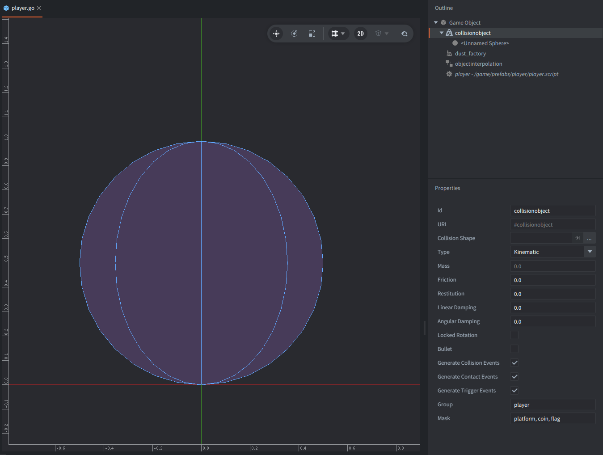
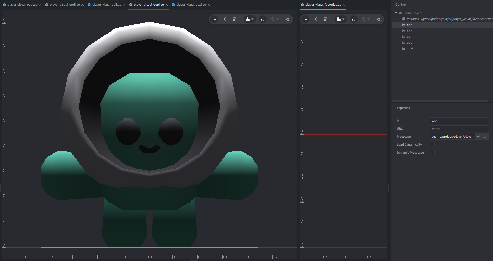
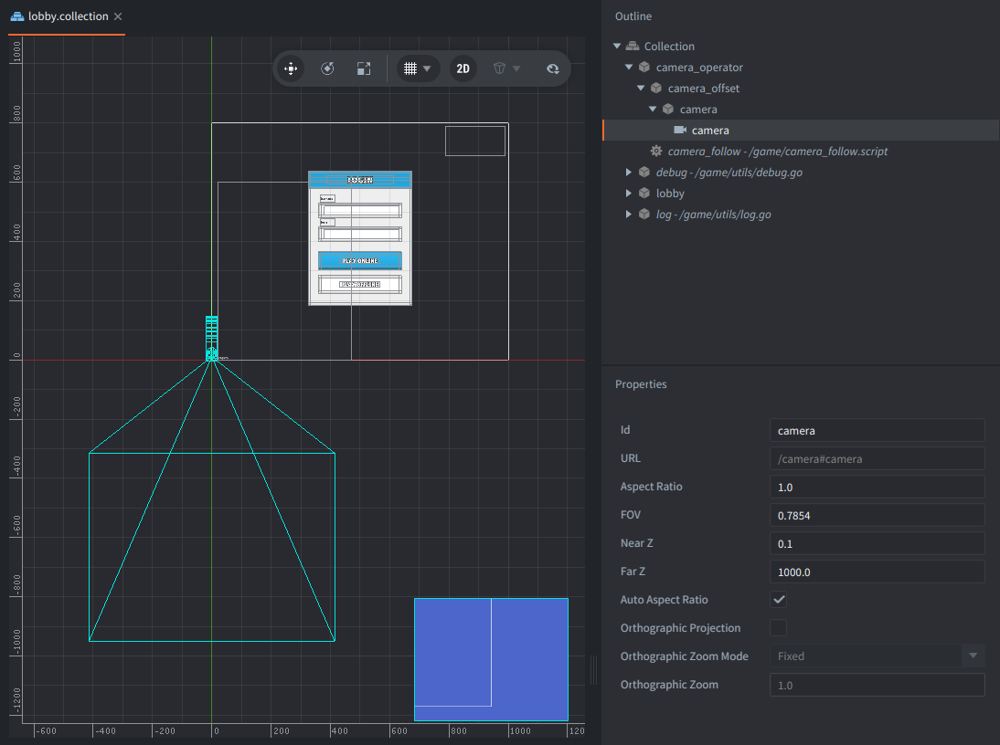
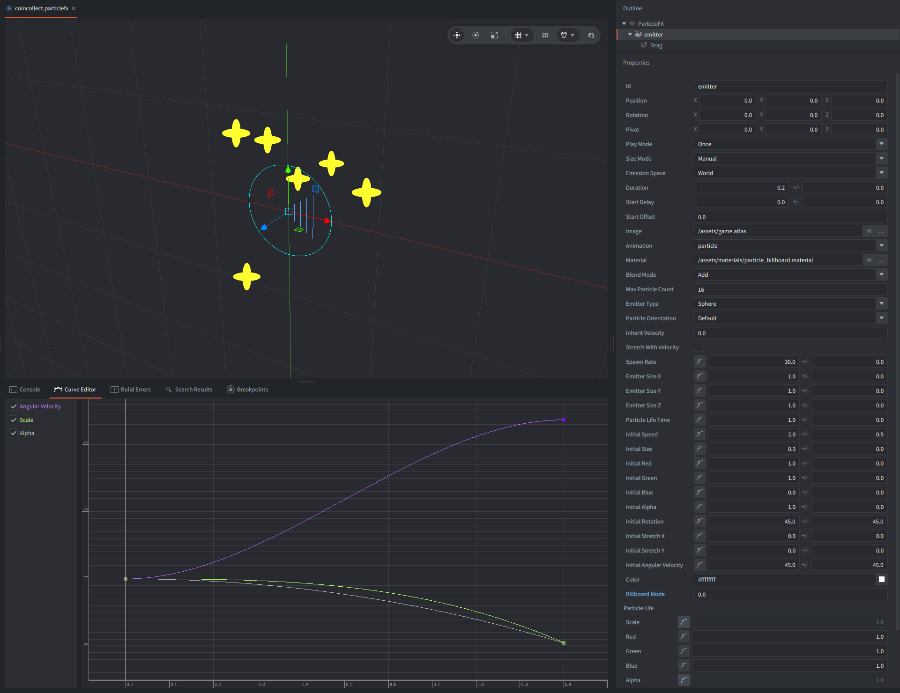
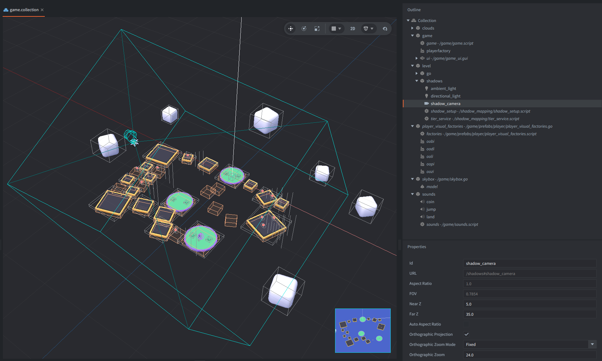

# Platformer Manual

This manual covers movement, camera, animation, effects, and rendering. Fusion setup and networking are documented in [README.md](README.md).

## Goal and controls

Collect 15 coins and reach the flag.

- Use <kbd>W</kbd><kbd>A</kbd><kbd>S</kbd><kbd>D</kbd>, a gamepad's <kbd>left stick</kbd>, or the <kbd>D-pad</kbd> to move the character relative to the camera.
- Press <kbd>Space</kbd> or a gamepad's <kbd>south face button</kbd> (e.g. <kbd>A</kbd> on Xbox controllers) to jump or double-jump.
- Move the mouse or use the arrow keys or a gamepad's right stick to rotate the camera around the character.
- Use the mouse wheel or gamepad shoulder buttons to change the camera distance (zoom).
- Press <kbd>Escape</kbd> to release the captured mouse input. Click inside the game window to capture it again and resume rotating the camera.

## Player

The player game object holds:

- a collision object with a sphere shape,
- `dust_factory` for creating 3D dust particles,
- an `objectinterpolation` component for interpolating the position,
- a `player` script that handles input, collisions, and movement logic.



The player's visuals (3D models) are managed by a separate `player_visual_factories` game object, which holds:

- a `player_visuals_factories` script responsible for spawning the selected model,
- five factories containing different models.



## Character movement

The player script (`game/prefabs/player/player.script`) contains a kinematic 3D character controller. It stores the velocity and transform used by Fusion. Movement and gravity handling run in `fixed_update()` at the project's 60 Hz physics rate. Each fixed step produces a new simulation position, and the interpolation component blends the model between those positions while frames are rendered.

Contact messages resolve penetration and determine whether a contacted surface is walkable. An additional short downward ray cast keeps the grounded state stable when collision shapes are touching but the current step produces no useful contact.

Input is gathered and processed to rotate the camera and calculate the character's velocity. Ground movement is designed to respond quickly, whereas air movement is less direct. The character gradually turns towards the movement direction. The jump code also provides variable jump height, coyote time, input buffering, and one mid-air jump (double jump).

Read more in the manuals about the [fixed update lifecycle](https://defold.com/manuals/application-lifecycle/), [3D physics](https://defold.com/manuals/physics/), [kinematic collision resolution](https://defold.com/manuals/physics-resolving-collisions/), and [ray casts](https://defold.com/manuals/physics-ray-casts/).

## Visual interpolation

The player's animated model is created as a separate visual object and assigned as the target of the [object-interpolation component](https://github.com/indiesoftby/defold-object-interpolation), which is part of a community native extension developed by Indiesoft LLC.

Collisions and networking use the player root position.

Respawning updates the player root and the interpolation component's stored position together. This prevents the model from moving across the level while interpolating from the previous location to the spawn point.

## Camera

The camera uses a small game object hierarchy in the lobby collection (the bootstrap collection):



```text
camera_operator       follow target position and horizontal rotation
└── camera_offset     vertical orbit rotation
    └── camera        distance from the target and camera component (zoom)
```

`game/camera_follow.script` updates the operator in `late_update()`, after simulation and object interpolation have supplied the latest target position. The camera uses the smoothed visual position of the interpolated object and also smooths its rotation and zoom through linear interpolation when handling input.

This parent-child setup lets Defold resolve the transforms automatically. Horizontal rotation is handled by `camera_operator`, vertical rotation by `camera_offset`, and zoom by changing the `camera` object's local distance.

The [Orbit Camera example](https://defold.com/examples/render/orbit_camera/) and [Camera manual](https://defold.com/manuals/camera/) cover a similar approach to handling cameras in Defold and provide more detailed explanations.

## Animation and effects

The controller chooses between idle, walk, and jump animations; the jump animation is also used while double-jumping and falling. To make movement feel more responsive, jumping and landing briefly stretch and squash the visual model. These actions also spawn short-lived dust objects built from 3D models, creating an effect that is also used while walking on a surface.

Remote players reproduce these effects when their replicated animation state changes.

Read more about the underlying setup in the [Model component](https://defold.com/manuals/model/), [Model animation](https://defold.com/manuals/model-animation/), and [Factory](https://defold.com/manuals/factory/) manuals. See [GPU Skinning](https://defold.com/examples/model/skinning/) for animated model setup and [Particle FX](https://defold.com/manuals/particlefx/) for effects.

## Rendering

The sample uses animated 3D models, one directional light, real-time shadow mapping, a skybox, particle effects, and billboarded artwork.

The skybox is based on Defold's [Skybox example](https://defold.com/examples/model/skybox/) and uses a custom material to produce a simple gradient between the bottom and top colors with the `mix` and `smoothstep` functions. It uses a normalized screen height (`var_screen_height`) passed from the vertex program to the fragment program.

The camera-facing visuals (the star particle effects around coins) follow the [Billboarding example](https://defold.com/examples/material/billboarding/).



### Directional lighting and shadows

The custom pipeline under `shadow_mapping/` first renders a depth map from the directional light, then samples it while drawing static and GPU-skinned models. Both model types cast and receive shadows.



The orthographic `shadow_camera` component on the `shadows` game object is required because it supplies the light-space view and projection matrices. Its **Orthographic Zoom**, **Near Z**, and **Far Z** values are the runtime source of truth for the shadow volume. `shadow_setup.script` follows the local player's interpolated visual, centers it between the near and far planes, and snaps the camera position to the active shadow map's texel grid. Shadow-map resolutions, PCF, polygon offset, and receiver bias remain properties of that script.

At startup, `tier_service.script` measures frame times and selects a global rendering tier:

- **Low** disables shadow rendering and uses unshadowed model materials.
- **Mid** uses a 2048 x 2048 shadow map and a single hard depth comparison.
- **High** uses a 4096 x 4096 shadow map and 3 x 3 PCF filtering.
- **Ultra** uses an 8192 x 8192 shadow map and 5 x 5 PCF filtering, provided that the graphics adapter supports a render target of that size.

The render script applies tier materials centrally. The depth texture uses nearest filtering. Explicit PCF, polygon offset, and a normal-dependent receiver bias keep edges soft and reduce shadow acne. Shadows affect directional diffuse light but not ambient or other lights.

The sampler order in every skinned material must remain `tex0`, `pose_matrix_cache`, `shadow_map`. Defold assigns the pose matrix cache to the first free model texture slot at runtime. Placing `shadow_map` before it causes the shadow shader to sample the pose texture instead, producing a fixed-looking dark region on animated models.

The pipeline uses one finite directional shadow map. Geometry outside it is lit, and point and spot lights do not cast shadows. See Defold's [Directional Light Shadows example](https://defold.com/examples/render/directional_light_shadows/) and the [Render](https://defold.com/manuals/render/), [Material](https://defold.com/manuals/material/), and [Shader](https://defold.com/manuals/shader/) manuals for more information.
