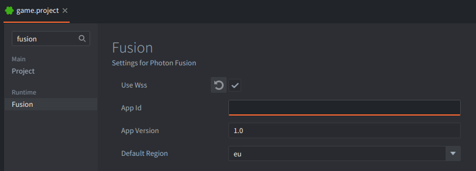
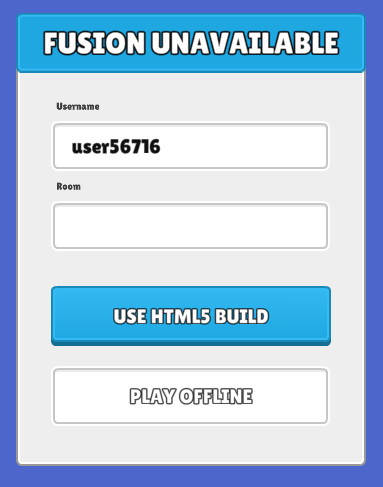
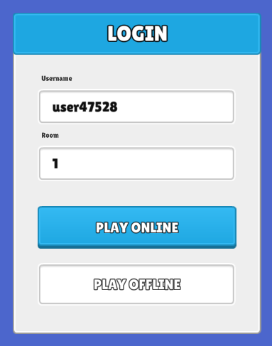
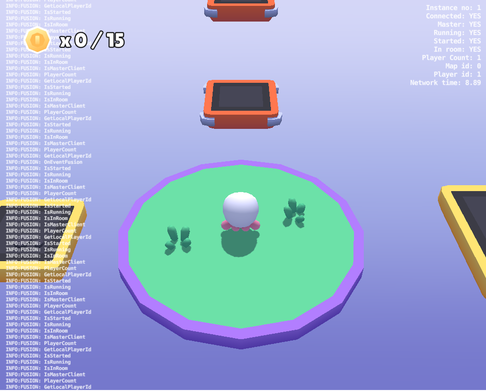

# Fusion Platformer Game Sample

Fusion Platformer Game Sample is a small multiplayer 3D game built with Defold and the [Photon Fusion extension](https://github.com/defold/extension-photon-fusion). This README explains how to configure and run the project, and walks through its networking code.

[Photon Fusion](https://doc.photonengine.com/fusion-core/v3/fusion-core-intro) for Defold brings scalable multiplayer networking to Defold as a drop-in native extension. It is built on the same battle-tested infrastructure that powers thousands of live titles across every major platform. You get room-based matchmaking, efficient state replication with support for late joins, physics prediction, and flexible RPCs. Better still, everything is designed from the ground up to feel native to Defold's workflow.

Learn more and get started by reading the [official Defold Fusion extension documentation](https://defold.com/extension-photon-fusion/).

See the [platformer manual](PLATFORMER.md) for information about game-specific features such as movement, camera behavior, animation, and rendering.

## Project setup

Online play requires a Photon Fusion App ID.

1. Create an [App ID in the Photon Fusion Dashboard](https://doc.photonengine.com/fusion/v2/getting-started/appid-instructions).

2. In Defold, open `game.project` and go to the `Runtime` -> `Fusion` tab (or search for "fusion").

3. Enter the App ID from the Photon dashboard in the `App Id` field.



## Build the HTML5 version

If Fusion is unavailable, the App ID is missing, or the game is run from a local build (`Project` -> `Build`), the login screen will show:



You can still run the game offline by clicking the `PLAY OFFLINE` button.

Build the HTML5 version (`Project` -> `Build HTML5`) to test it in a web browser.

You can also serve the generated HTML5 files (`Project` -> `Bundle` -> `HTML5 Application`) from the bundle directory, for example:

```sh
python3 -m http.server 8765 --bind 127.0.0.1 --directory dist/wasm-web/FusionPlatformer
```

The Python process serves the game files over HTTP. Then open the provided address (`http://127.0.0.1:8765/`) in the browser to test the game.

After rebuilding, restart the HTTP server in the new bundle directory and hard-refresh the browser with `Ctrl+Shift+R` so that it does not load an older cached archive.

## Run and test online

If Fusion is available and an App ID is configured, the login screen will show:



Enter a room name to join or create that room. To connect from another client, enter the same room name. A username is generated randomly each time.

Each game client connects to Photon Cloud using the App ID compiled into the bundle, so the HTTP port is unrelated to the Fusion room and can be changed freely.

## Diagnostics overlay

Press the <kbd>L</kbd> key to toggle the Fusion diagnostics overlay.



## Session startup

The connection flow is implemented in `game/lobby/lobby.script`:

1. `fusion.init_from_settings()` reads the compiled Fusion settings.
2. `fusion.connect()` connects the user to Photon.
3. `fusion.join_or_create_room()` enters the requested room, creating it when needed.
4. `fusion.start()` starts the simulation.
5. The master client creates the Fusion map with `fusion.map_change()`.
6. Other clients receive its identifier in `EVENT_MAP_CHANGE`.
7. The Defold game collection is created after the map is available.

These operations complete asynchronously. The helper module `game/utils/wait.lua` lets the startup coroutine yield between frames until each Fusion state is ready, while the normal Defold update loop continues to run.

The first client in a room becomes the "master" client. Authority checks in the gameplay code continue to work if Fusion assigns that role to another client later.

## Ownership and replicated properties

Players are spawned with `OWNERMODE_PLAYERATTACHED`, giving each client authority over its own character. Shared map objects use `OWNERMODE_MASTERCLIENT`; these include coins, falling platforms, and the game object that stores the winner.

In Photon Fusion, replicated properties, called [Networked Properties](https://doc.photonengine.com/fusion/v2/manual/data-transfer/networked-properties), automatically synchronize game state across connected clients.

| Object | Replicated properties | Use |
| --- | --- | --- |
| Player | `net_coins` | Confirmed score used by the UI and win condition |
| Player | `net_animation_state` | Current animation state seen by remote clients |
| Player | `net_visual_variant` | Character model selected by the player's authority |
| Falling platform | `net_cooldown_finish_time`, `net_is_active` | Fall and reactivation schedule |
| Game | `net_winner` | Winner shown by every client |

Fusion automatically replicates player transforms. The rendering side of player movement is described in the [platformer manual](PLATFORMER.md#visual-interpolation).

## Remote Procedure Calls

The project sends transient gameplay events as [Remote Procedure Calls](https://doc.photonengine.com/fusion/v2/manual/data-transfer/rpcs) (RPCs):

| RPC | Route | Use |
| --- | --- | --- |
| `RPC_REQUEST_COIN_COLLECTED` | Collector → coin authority | Requests validation of a collision |
| `RPC_COIN_COLLECTED` | Coin authority → collector | Confirms the score increment |
| `RPC_DISABLE`, `RPC_ENABLE` | Coin authority → all clients | Updates the coin's visible and collidable state |
| `RPC_JUMP`, `RPC_LAND` | Player authority → all clients | Plays the action sound once on each client |
| `RPC_RESPAWN_ALL_PLAYERS` | Game authority → all clients | Starts the next round |

Coin collection is handled in `game/prefabs/coin/coin.script`. A collector hides the coin immediately and sends a request to the client that owns it. The owner accepts the first request, confirms the score for that collector, broadcasts the coin's hidden state, and schedules its respawn. The score changes after this confirmation arrives.

Falling platforms use a replicated deadline based on Fusion's network time. Every client starts the fall when the deadline passes; replicated state transitions are written by the authority.

## Winning and starting the next round

The master client handles flag collisions and checks the player's confirmed `net_coins` value. When the requirement is met, it sets `net_winner`, waits five seconds, clears the winner, and broadcasts `RPC_RESPAWN_ALL_PLAYERS`. Each client responds by resetting the player it owns.
